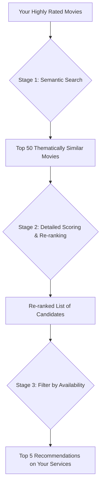

# Letterboxd CLI

A powerful, local-first movie recommendation and watchlist management tool that integrates your Letterboxd history with TMDb data. It uses a hybrid approach with semantic search and a detailed taste profile to provide nuanced movie suggestions.

## Features

- **Hybrid Personalized Recommendations:** Get movie suggestions based on a sophisticated analysis of your highly-rated movies, combining semantic search on movie overviews with a detailed taste profile of your favorite genres, actors, and directors.
- **Direct Data Sync:** Keep your local data up-to-date by syncing directly with your Letterboxd account, fetching your diary, ratings, and watchlist (via CSV or Scraping).
- **Watch Availability:** Check where movies are streaming in your country based on your specific subscriptions.
- **Watchlist Tracking:** Monitor your Letterboxd watchlist for availability changes on streaming platforms.
- **Random Movie Suggestions:** Get a random movie suggestion with details and reasons based on your taste profile, intelligently filtered to exclude movies you've already seen.
- **Local-First:** All your data and movie embeddings stay on your machine in a local SQLite and ChromaDB instance.

## Setup and Usage

### Prerequisites

- **Node.js:** v18 or higher.
- **TMDb API Key:** Required for movie data and streaming provider information.
- **Letterboxd Account:** To export your data or provide a profile URL for scraping.

### Setup

1.  **Clone the repository:**
    ```bash
    git clone https://github.com/your-username/letterboxd-cli.git
    cd letterboxd-cli
    ```

2.  **Install dependencies:**
    ```bash
    npm install
    ```

3.  **Configure Environment Variables:**
    Copy the `.env.example` to `.env` and fill in your details:
    ```bash
    cp .env.example .env
    ```
    - `TMDB_API_KEY`: Your TMDb API key.
    - `LETTERBOXD_USERNAME`: Your Letterboxd username.
    - `STREAMING_COUNTRY_CODE`: Your 2-letter country code (e.g., US, GB, NG).

### Running the CLI

The CLI automatically handles starting its own ChromaDB "sidecar" instance for vector embeddings in the background.

```bash
# Start the full stack (ChromaDB + CLI)
npm start
```

### Running via npx
You can run the CLI directly from your GitHub repository from any directory (ensure your `.env` is in that directory):

```bash
npx github:your-username/letterboxd-cli
```

## How the Recommendation Engine Works

The recommendation engine is a hybrid system that combines the power of modern semantic search with a classic, detailed taste profile analysis.

### High-Level Overview

The process can be visualized as a funnel. We start by finding a broad set of movies that are thematically similar to what you like (semantic search), and then we meticulously re-rank that set based on the specific details (genres, actors, directors) that make up your unique taste.



### Stage 1: Semantic Search & Taste Profile Embedding
We generate embeddings for each of your highly-rated movies using a sentence-transformer model (`Xenova/all-MiniLM-L6-v2`). We then create a "Taste Profile Embedding" by averaging these vectors and use it to search ChromaDB for the top 50 thematically similar candidates.

### Stage 2: Detailed Scoring & Re-ranking
We build a detailed profile of your preferences by counting genres, actors, and directors from your history. Each candidate from Stage 1 is then scored against this profile. The final hybrid score ensures recommendations are both thematically relevant and feature the specific elements you enjoy.

## Offline / Restricted Network Setup

If you are on a network that blocks access to Hugging Face, you can use a local model cache:

1.  **Download the model files:**
    ```bash
    git clone https://huggingface.co/Xenova/all-MiniLM-L6-v2 ./.cache/transformers/Xenova/all-MiniLM-L6-v2
    ```

2.  **Enable Local Model Loading:**
    In your `.env` file, set:
    ```bash
    HUGGINGFACE_USE_LOCAL_MODELS=true
    HUGGINGFACE_MODEL_PATH=./.cache/transformers
    ```

## Development Project Structure

- `src/cli.ts`: Core interactive prompt loop.
- `src/services/data-sync.service.ts`: Handles syncing data from Letterboxd.
- `src/services/recommendation.service.ts`: Hybrid recommendation logic.
- `src/services/vector.service.ts`: ChromaDB interaction.
- `src/services/cache.service.ts`: SQLite persistence for metadata.
