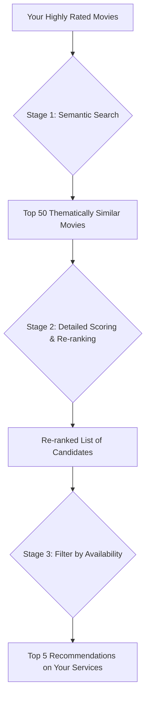
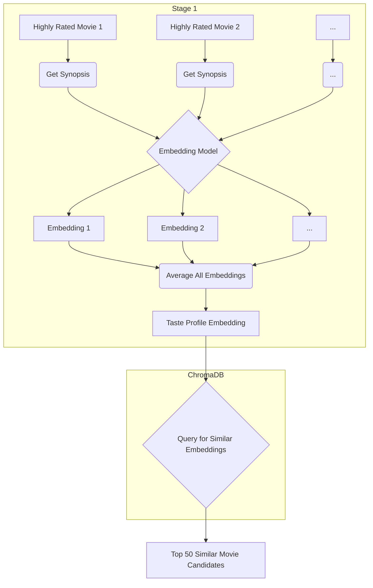

# Letterboxd CLI

This is a command-line interface (CLI) tool for interacting with your Letterboxd data. It uses a hybrid approach with semantic search and a detailed taste profile to provide personalized movie recommendations, track your watched movies, manage your watchlist, and find where to watch movies based on your streaming services.

## Features

-   **Hybrid Personalized Recommendations:** Get movie recommendations based on a sophisticated analysis of your highly-rated movies, combining semantic search on movie overviews with a detailed taste profile of your favorite genres, actors, and directors.
-   **Direct Letterboxd Data Sync:** Keep your local data up-to-date by syncing directly with your Letterboxd account, fetching your diary, ratings, and watchlist.
-   **Watched Movies Tracking:** See how many movies you've watched and list movies from specific years.
-   **Watchlist Management:** View your watchlist and get suggestions for movies available on your subscribed streaming services.
-   **Where to Watch:** Find streaming availability for any movie in your region.
-   **Random Movie Suggestions:** Get a random movie suggestion with details and reasons based on your taste profile, intelligently filtered to exclude movies you've already seen or have on your watchlist.

## Setup and Usage

### Prerequisites

-   Node.js (v18 or higher recommended)
-   npm (Node Package Manager)
-   A TMDb API Key (get one from [TMDb](https://www.themoviedb.org/documentation/api))
-   [ChromaDB](https://www.trychroma.com/): The application requires a running ChromaDB server for the recommendation engine. The easiest way to run this is via `npx`.
-   Your Letterboxd data: You can start by placing your exported CSV files (`diary.csv`, `watchlist.csv`, `ratings.csv`) in the `data/` directory, and then keep them updated using the in-app sync feature.

### Setup

1.  **Clone the repository:**
    ```bash
    git clone https://github.com/your-repo/letterboxd-cli.git
    cd letterboxd-cli
    ```

2.  **Install dependencies:**
    ```bash
    npm install
    ```

3.  **Set up environment variables:**
    Create a `.env` file in the root directory based on `.env.example` and fill in your details:
    ```
    # Letterboxd Credentials (for data sync)
    LETTERBOXD_USERNAME=your_username
    LETTERBOXD_PASSWORD=your_password

    # TMDb API Key
    TMDB_API_KEY=your_tmdb_api_key_here

    # Your 2-letter country code for streaming availability
    STREAMING_COUNTRY_CODE="US"

    # For offline/restricted network setup (see below)
    USE_LOCAL_HF_MODELS=false
    ```
    *Note: Streaming services are now configured interactively within the CLI.*

4.  **Run the ChromaDB Server:**
    Open a **separate terminal window** and run the following command from the project root:
    ```bash
    npx chroma run --path ./data/chroma_db
    ```
    This will start the ChromaDB server and store its data in the `./data/chroma_db` directory. **Leave this terminal running.**

### Offline / Restricted Network Setup

If you are on a network that blocks access to Hugging Face, the application will fail when trying to download the embedding model. Follow these steps to use a local model cache:

1.  **Download the model files:**
    From a network without restrictions, download the files for the `Xenova/all-MiniLM-L6-v2` model. The easiest way is to clone the repository:
    ```bash
    git clone https://huggingface.co/Xenova/all-MiniLM-L6-v2 ./.cache/transformers/Xenova/all-MiniLM-L6-v2
    ```
    This will download all necessary files directly into the correct directory.

2.  **Enable Local Model Loading:**
    In your `.env` file, set `USE_LOCAL_HF_MODELS` to `true`:
    ```
    USE_LOCAL_HF_MODELS=true
    ```
    The application will now load the model from your local cache and will not attempt to connect to Hugging Face.

### Running the CLI
Start the ChromaDB server with 

```bash
npx chroma run --path ./data/chroma_db
```

With the ChromaDB server running in a separate terminal, start the application:

```bash
npm run dev
```

You will be presented with a menu of options to interact with your data.

## How the Recommendation Engine Works

The recommendation engine is a hybrid system that combines the power of modern semantic search with a classic, detailed taste profile analysis. This two-stage process allows for more nuanced and personalized recommendations than a single approach alone.

### High-Level Overview

The process can be visualized as a funnel. We start by finding a broad set of movies that are thematically similar to what you like (semantic search), and then we meticulously re-rank that set based on the specific details (genres, actors, directors) that make up your unique taste.



---

### Stage 1: Semantic Search & Taste Profile Embedding

The first stage aims to understand the *substance* of the movies you enjoy.

1.  **Embedding Generation:** For each of your highly-rated movies, we fetch its synopsis (overview) from TMDb. This text is then passed to a sentence-transformer model (`Xenova/all-MiniLM-L6-v2`) which converts the text into a numerical representation called an **embedding**. This embedding is a vector of numbers that captures the semantic meaning of the movie's plot. These embeddings are stored in ChromaDB.

2.  **Creating a "Taste Profile Embedding":** To understand your overall taste, we average the embeddings of all your highly-rated movies. This creates a single "taste profile embedding" that represents the average semantic meaning of the movies you love.

3.  **Semantic Search:** This taste profile embedding is then used as a query in ChromaDB. We search for the top 50 movies in our database whose embeddings are most similar to your taste profile embedding. This gives us a list of candidate movies that are thematically aligned with your preferences.



---

### Stage 2: Detailed Scoring & Re-ranking

While semantic search is powerful, it doesn't capture everything. You might like movies with a certain actor or director, regardless of the plot. Stage 2 addresses this by analyzing the specific details.

1.  **Building a Detailed Taste Profile:** We create a detailed profile of your preferences by counting the occurrences of genres, actors (top 5 from each movie), directors, and writers across all your highly-rated movies. This gives us a weighted map of your favorite attributes (e.g., "Sci-Fi: 10", "Christopher Nolan: 5", "Tom Cruise: 3").

2.  **Scoring the Candidates:** Each of the 50 candidate movies from Stage 1 is then scored against this detailed profile.
    -   Does it match your favorite genres? **+ points**
    -   Does it feature your favorite actors? **+ points**
    -   Is it directed by a director you like? **+ points**

3.  **Final Hybrid Score:** The final score for each candidate is a combination of its **semantic similarity score** (from Stage 1) and this new **detailed score**. This hybrid score ensures that the recommendations are not only thematically relevant but also feature the specific elements you enjoy. The candidates are then re-ranked based on this final score.

---

### Stage 3: Filtering by Availability

Finally, if you've chosen to see recommendations available on your streaming services, the re-ranked list is filtered to show only those movies available on the services you subscribe to in your region. This gives you a final, actionable list of movies you can watch right now.


## Development

### Project Structure

-   `src/index.ts`: Main application entry point, launches the CLI.
-   `src/cli.ts`: Contains the core `inquirer` prompt loop and user interaction logic.
-   `src/services/data-sync.service.ts`: Handles syncing data directly from Letterboxd using Puppeteer.
-   `src/services/embedding.service.ts`: Manages the loading of the sentence-transformer model from Hugging Face and generates embeddings for movie overviews.
-   `src/services/vector.service.ts`: A service to interact with the ChromaDB vector store (adding and querying movie embeddings).
-   `src/services/tmdb.service.ts`: Interacts with the TMDb API.
-   `src/services/recommendation.service.ts`: Contains the logic for generating movie recommendations using a hybrid of semantic search and a detailed taste profile.
-   `src/services/cache.service.ts`: Manages an SQLite cache for API responses and other data.

### Contributing

Feel free to fork the repository and submit pull requests.
